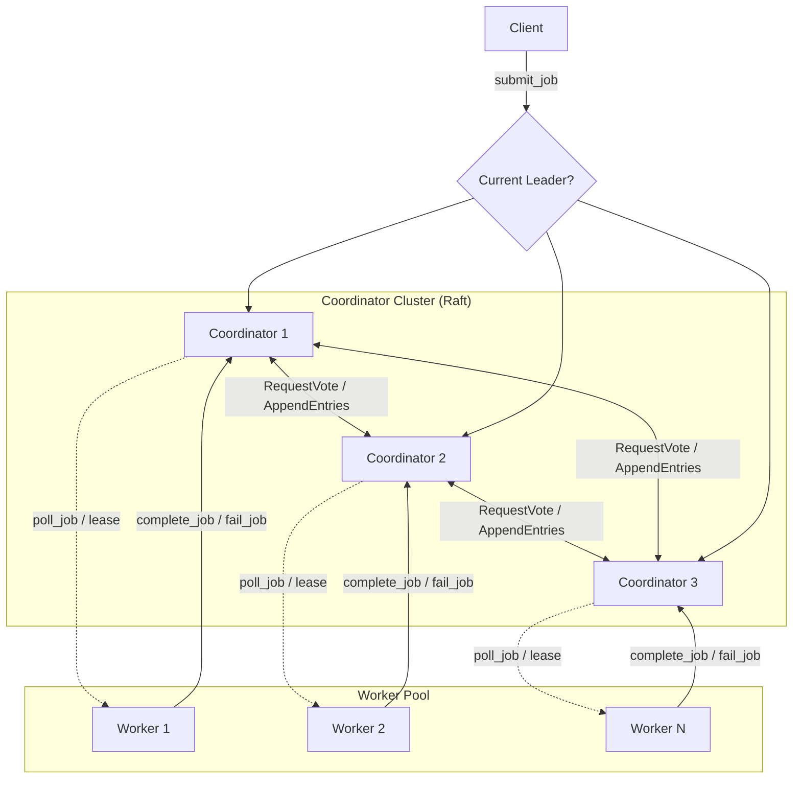
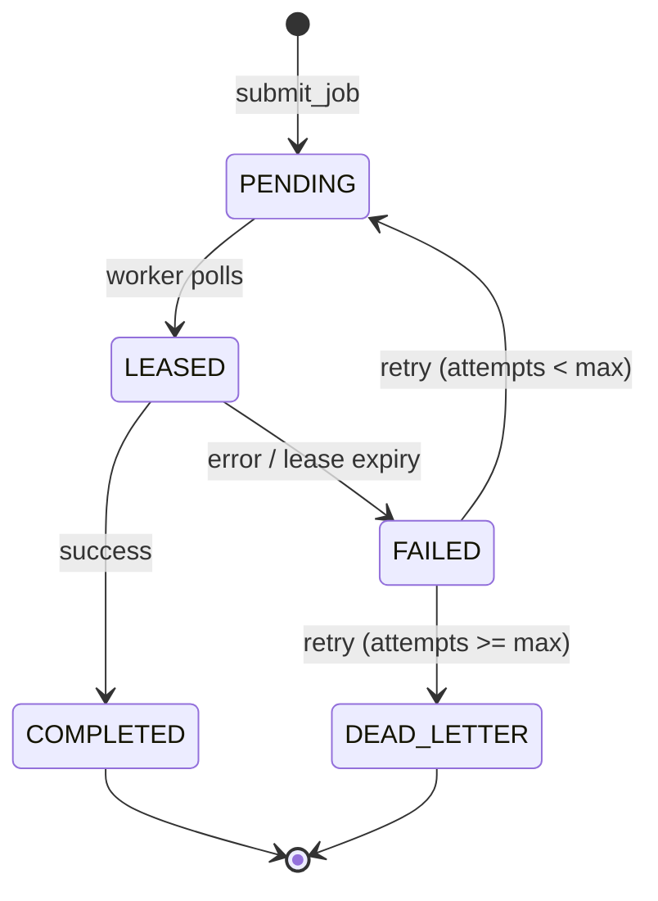

# Distributed Job Scheduler & Task Queue

[](https://www.python.org/)
[](https://fastapi.tiangolo.com/)
[](#license)
[](#what-this-demonstrates)

A fault-tolerant, distributed job scheduling system built from first principles in Python — implementing a simplified Raft consensus protocol for leader election and log replication, lease-based job dispatch, at-least-once delivery, idempotent execution, and fencing-token-based split-brain protection.

This is not a wrapper around Celery or RabbitMQ. The coordinator cluster, consensus logic, leader election, log replication, and failure-recovery paths are implemented from scratch — the goal is to demonstrate working understanding of distributed-systems fundamentals, not to integrate an existing queue.

> 🚧 **Under active development.** This README documents the full intended design. Some endpoints and components below are implemented; others are in progress — see inline notes in the [API Reference](#api-reference).

---

## Table of Contents

- [What This Demonstrates](#what-this-demonstrates)
- [Architecture](#architecture)
- [Key Engineering Decisions](#key-engineering-decisions)
- [Tech Stack](#tech-stack)
- [Project Structure](#project-structure)
- [Getting Started](#getting-started)
- [API Reference](#api-reference)
- [Job Lifecycle](#job-lifecycle)
- [Fault Tolerance: What's Actually Tested](#fault-tolerance-whats-actually-tested)
- [Testing](#testing)
- [Future Work](#future-work)
- [License](#license)

---

## What This Demonstrates

Most portfolio projects are CRUD apps with a database behind them. This one is built around problems that only exist once you have multiple independent processes that can crash, restart, and disagree with each other:

| Problem | What's implemented |
|---|---|
| **Consensus** | A simplified Raft protocol — leader election via randomized timeouts and majority voting, log replication with commit-index tracking. |
| **Concurrency** | Fully async (asyncio/FastAPI) — election timers, heartbeats, and job dispatch all run as concurrent background tasks per node. |
| **Fault tolerance** | Cluster survives a minority of node failures with no data loss; jobs survive worker crashes via lease expiry and redelivery. |
| **Correctness under failure** | Fencing tokens prevent a deposed leader from corrupting state after a new election — the subtle part most "leader election" projects skip. |
| **Delivery semantics** | At-least-once delivery, deliberately chosen over exactly-once (which is provably impossible across an unreliable network) — paired with idempotent execution to make redelivery safe. |
| **Testing rigor** | Integration tests that kill real processes mid-operation (leader crash, worker crash, stale-leader fencing) rather than only testing happy paths. |

Each of these is documented with the reasoning behind it in [Key Engineering Decisions](#key-engineering-decisions) below.

---

## Architecture



**Coordinator cluster (3 nodes):** Runs a simplified Raft protocol to elect a single leader and replicate a committed log of job-state transitions. Tolerates 1 node failure while maintaining availability and consistency (`N=3`, quorum `= 2`).

**Worker pool (N nodes):** Stateless executors. Register with the current leader, poll for leased jobs, execute, and report results back with an idempotency key.

**Client:** Submits jobs with a caller-supplied idempotency key and polls for status. Never talks to a follower for writes — gets redirected to the current leader.

---

## Key Engineering Decisions

| Decision | Reasoning |
|---|---|
| **Simplified Raft, not full spec** | Implements leader election + log replication + commit index. Deliberately skips log compaction/snapshotting and dynamic cluster membership changes to keep scope realistic for a 1-week build — documented explicitly rather than silently omitted. |
| **At-least-once delivery, not exactly-once** | Exactly-once delivery is provably impossible in an asynchronous network with node failures. At-least-once + idempotent execution is the standard, correct real-world answer (this is how SQS, Kafka, and Celery all actually work). |
| **Idempotency at two layers** | (1) **Submission-level**: duplicate client idempotency keys return the existing job instead of creating a new one. (2) **Execution-level**: a dedupe table ensures a redelivered job's side effects don't re-run even if "submit" dedup is bypassed. |
| **Fencing tokens on job leases** | Each lease is stamped with the leader's current Raft term. A leader that's since been deposed has its completion/failure reports rejected by the new leader — this is what actually prevents split-brain state corruption, not leader election alone. |
| **HTTP/REST over gRPC** | Faster to build and debug within the timeline; the RPC *semantics* (RequestVote, AppendEntries) are what matter for demonstrating Raft, not the wire protocol. Noted in Future Work as a production upgrade. |
| **SQLite for persisted state** | Raft requires `currentTerm` and `votedFor` to survive a process crash/restart — durability matters more than throughput here. Each node has its own local SQLite file (no shared state across nodes, which would defeat the point). |

---

## Tech Stack

- **Python 3.12**
- **FastAPI** — HTTP RPC layer for both inter-coordinator Raft messages and worker/client-facing APIs
- **uvicorn** — ASGI server, one process per simulated node
- **httpx (async)** — inter-node RPC calls
- **pydantic** — typed models for jobs, log entries, and RPC payloads
- **aiosqlite** — durable per-node Raft state and job store
- **Docker + Docker Compose** — process isolation for realistic kill/restart fault-injection testing
- **pytest + pytest-asyncio** — unit and chaos/integration testing

---

## Project Structure

```
distributed-job-scheduler/
├── coordinator/
│   ├── main.py          # FastAPI app: Raft RPC endpoints + job endpoints
│   ├── raft_state.py     # Election timer, term/vote logic, role transitions
│   └── storage.py        # Durable persistence (SQLite) for Raft state + log
├── worker/
│   └── main.py           # Registration, polling loop, job execution, reporting
├── client/
│   └── main.py           # Job submission + status polling CLI/client
├── common/
│   ├── models.py         # Shared pydantic models (Job, LogEntry, RPC payloads)
│   └── rpc_client.py      # Shared async HTTP client for inter-node calls
├── tests/                 # Unit tests + chaos/failure-injection tests
├── Dockerfile
├── docker-compose.yml
├── requirements.txt
├── ARCHITECTURE.md         # Deeper design notes, state diagrams
└── README.md
```

---

## Getting Started

### Local development (no Docker required)

```bash
git clone <repo-url>
cd distributed-job-scheduler
python3 -m venv venv
source venv/bin/activate   # Windows: venv\Scripts\activate
pip install -r requirements.txt
```

Run a 3-node coordinator cluster + 2 workers, each in its own terminal:

```bash
NODE_ID=coordinator-1 uvicorn coordinator.main:app --port 8001
NODE_ID=coordinator-2 uvicorn coordinator.main:app --port 8002
NODE_ID=coordinator-3 uvicorn coordinator.main:app --port 8003
WORKER_ID=worker-1 uvicorn worker.main:app --port 8011
WORKER_ID=worker-2 uvicorn worker.main:app --port 8012
```

Verify the cluster is alive:

```bash
curl http://localhost:8001/health
curl http://localhost:8002/health
curl http://localhost:8003/health
```

### Containerized (recommended for fault-injection testing)

```bash
docker-compose up --build
```

Simulate a node failure:

```bash
docker-compose stop coordinator-1
# watch the remaining nodes elect a new leader within the election timeout window
docker-compose start coordinator-1
# watch it rejoin as a follower and catch up via log replication
```

---

## API Reference

> Endpoints marked **(planned)** are part of the committed design and land as the project progresses.

### Coordinator — Raft internal RPCs (node-to-node only)

| Method | Endpoint | Description |
|---|---|---|
| `POST` | `/raft/request_vote` | Candidate requests a vote from a peer during an election. *(planned)* |
| `POST` | `/raft/append_entries` | Leader replicates log entries / sends heartbeats. *(planned)* |

### Coordinator — Client/worker-facing

| Method | Endpoint | Description |
|---|---|---|
| `GET` | `/health` | Node liveness + identity check. ✅ implemented |
| `POST` | `/submit_job` | Submit a job with an idempotency key. Redirects to leader if called on a follower. *(planned)* |
| `GET` | `/job/{job_id}` | Poll job status. *(planned)* |
| `POST` | `/worker/register` | Worker registers itself with the leader. *(planned)* |
| `POST` | `/worker/poll_job` | Worker requests a job lease. *(planned)* |
| `POST` | `/worker/complete_job` | Worker reports successful completion (carries fencing term). *(planned)* |
| `POST` | `/worker/fail_job` | Worker reports failure for retry/dead-letter handling. *(planned)* |
| `GET` | `/status` | Cluster-wide status: current leader, queue depth, dead-letter count. *(planned)* |

### Worker

| Method | Endpoint | Description |
|---|---|---|
| `GET` | `/health` | Worker liveness check. ✅ implemented |

---

## Job Lifecycle



A job's lease carries the leader's Raft **term** at the time it was issued. Completion/failure reports are only accepted if that term still matches the *current* leader's term — this is the fencing mechanism that prevents a stale leader from corrupting committed state after a new election.

---

## Fault Tolerance: What's Actually Tested

| Scenario | Expected Behavior |
|---|---|
| Leader crashes | Remaining nodes elect a new leader within the election timeout window; no job state is lost (it was already replicated to a majority before crash). |
| Worker crashes mid-job | Lease expires; job returns to `PENDING` and is picked up by a different worker — this is the at-least-once guarantee in action. |
| Duplicate job submission (same idempotency key) | Second submission returns the existing job rather than creating a duplicate. |
| Redelivered job executes twice | Execution-level dedupe table ensures the side effect only happens once. |
| Deposed leader tries to validate a stale lease | Rejected — fencing token (term) no longer matches current leader's term. |
| Network partition isolates minority of coordinators | Minority cannot elect a leader or commit writes (no quorum) — preserves consistency over availability for that partition, per CAP tradeoffs. |

---

## Testing

```bash
pytest tests/ -v
```

Includes:
- Unit tests for Raft term/vote logic and state transitions
- Integration tests simulating leader crash, worker crash, and stale-leader fencing
- A chaos script that randomly stops/starts containers on a timer during a sustained job submission load, asserting no job is lost or double-executed

---

## Future Work

Deliberately out of scope for this build — listed explicitly rather than left unaddressed:

- **Log compaction / snapshotting** — without it, the replicated log grows unbounded; production Raft implementations periodically snapshot state and truncate the log.
- **Dynamic cluster membership changes** — adding/removing coordinator nodes safely mid-operation (Raft's joint-consensus approach) is intentionally not implemented.
- **gRPC instead of HTTP/REST** — would reduce serialization overhead and give stronger typing on the wire; HTTP was chosen here to optimize for build speed within the timeline.
- **Multi-leader-per-shard scaling** — this implementation is a single Raft group; horizontal scaling would require partitioning jobs across multiple independent Raft groups.
- **Persistent worker state** — workers are currently stateless and re-register on restart; no work-in-progress recovery on worker crash beyond lease expiry.

---

## License

MIT
