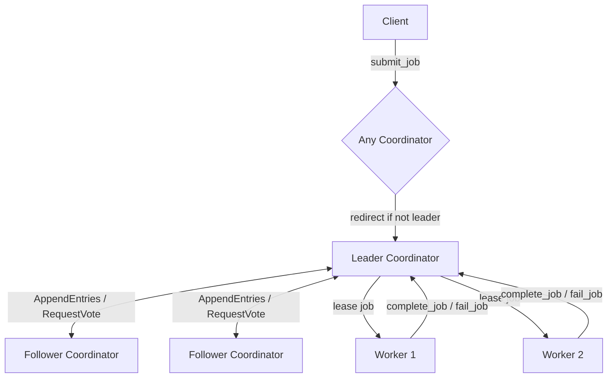

# Distributed Job Scheduler with Fault Tolerance

A distributed task queue where multiple worker nodes pull jobs off a queue coordinated by a cluster running a simplified Raft consensus protocol. Built to survive leader crashes, worker crashes, and network hiccups without losing jobs or double-executing them.

> **Status:** 🚧 In active development — see [Build Status](#build-status) below for what's done vs. in progress.

---

## Why this exists

Most CRUD projects don't touch the actual hard problems in backend engineering: what happens when the machine running your code dies mid-task? How do multiple nodes agree on who's in charge without a single point of failure? How do you guarantee a job runs *at least once* without accidentally running it *twice*?

This project implements:
- **Leader election** via a simplified Raft consensus protocol across a 3-node coordinator cluster
- **At-least-once job delivery** with lease-based dispatch and automatic retry on worker failure
- **Idempotency keys** so retried/duplicated job delivery never causes duplicate side effects
- **Fencing tokens** to prevent a deposed leader from corrupting state after a new leader has taken over
- **Dead-letter handling** for jobs that exhaust their retry budget

---

## Architecture



**Coordinator cluster (3 nodes):** Runs a simplified Raft protocol to elect a single leader and replicate a log of job-state-change events to followers. Tolerates 1 node failure (majority = 2 of 3). The leader is the only node that accepts job submissions and dispatches work; followers redirect clients to the current leader.

**Worker pool (N nodes):** Independent processes that register with the leader, poll for available jobs, execute them, and report success/failure back. Workers know nothing about Raft — they only ever talk to "whoever the current leader is."

**Client:** Submits jobs with a self-chosen idempotency key and polls for job status.

### Job state machine

```
PENDING → LEASED → COMPLETED
            ↓
          FAILED → RETRYING → (back to PENDING, or...)
            ↓
        DEAD_LETTER  (after max retry attempts exhausted)
```

---

## Tech stack

| Layer | Choice | Why |
|---|---|---|
| Language | Python 3.12 | Fast to build correct distributed logic without fighting a type system mid-design |
| Web/RPC framework | FastAPI + uvicorn | Doubles as the inter-node RPC layer (RequestVote, AppendEntries, job APIs) |
| HTTP client | httpx (async) | Async calls between nodes without blocking the event loop |
| Data models | Pydantic | Strict schemas for jobs, log entries, RPC payloads |
| Persistence | SQLite (aiosqlite) | Each node persists Raft term/vote/log + job state to disk — survives a process restart |
| Containerization | Docker + docker-compose | Run nodes as truly isolated processes; kill/restart individual nodes to test fault tolerance |
| Testing | pytest + pytest-asyncio | Unit tests + chaos/failure-injection integration tests |

---

## Project structure

```
distributed-job-scheduler/
├── coordinator/
│   ├── main.py          # FastAPI app: RPC endpoints (RequestVote, AppendEntries, job APIs)
│   ├── raft_state.py     # Raft state machine: roles, terms, election timers
│   └── storage.py        # Persistent log + term/vote storage (SQLite)
├── worker/
│   └── main.py           # Worker process: registration, polling, job execution
├── client/
│   └── main.py           # CLI/script for submitting jobs and polling status
├── common/
│   ├── models.py          # Shared Pydantic models (Job, LogEntry, RPC payloads)
│   └── rpc_client.py      # Shared async HTTP client for node-to-node calls
├── tests/                 # Unit + chaos/integration tests
├── docker-compose.yml
├── Dockerfile
├── requirements.txt
└── ARCHITECTURE.md        # Deeper design notes and decision log
```

---

## Running it

### Locally (no Docker — current setup during development)

```bash
python3 -m venv venv
source venv/bin/activate
pip install -r requirements.txt
```

Run each node in its own terminal:

```bash
NODE_ID=coordinator-1 uvicorn coordinator.main:app --port 8001
NODE_ID=coordinator-2 uvicorn coordinator.main:app --port 8002
NODE_ID=coordinator-3 uvicorn coordinator.main:app --port 8003
WORKER_ID=worker-1   uvicorn worker.main:app       --port 8011
WORKER_ID=worker-2   uvicorn worker.main:app       --port 8012
```

Verify all nodes are up:

```bash
curl http://localhost:8001/health
curl http://localhost:8002/health
curl http://localhost:8003/health
curl http://localhost:8011/health
curl http://localhost:8012/health
```

### With Docker (target — once containerized)

```bash
docker-compose up --build
```

To simulate a node crash:

```bash
docker stop coordinator-2
```

---

## API overview

| Endpoint | Node | Purpose |
|---|---|---|
| `GET /health` | all | Liveness check |
| `POST /request_vote` | coordinator | Raft leader election RPC |
| `POST /append_entries` | coordinator | Raft log replication / heartbeat RPC |
| `POST /submit_job` | coordinator (leader) | Client submits a new job with an idempotency key |
| `GET /poll_job` | coordinator (leader) | Worker requests a leased job |
| `POST /complete_job` | coordinator (leader) | Worker reports successful completion |
| `POST /fail_job` | coordinator (leader) | Worker reports failure (triggers retry logic) |
| `GET /status` | coordinator | Cluster state: current leader, queue depth, DLQ count |

*(Full request/response schemas in `common/models.py`.)*

---

## Key design decisions

- **Simplified Raft, not full spec.** No log compaction/snapshotting, no dynamic cluster membership changes. The goal is to correctly demonstrate leader election + log replication + the failure-handling behaviors that depend on them — not to reimplement etcd.
- **At-least-once, not exactly-once delivery.** Exactly-once delivery across a network is famously not achievable in the general case. Instead, the system guarantees at-least-once delivery and pushes deduplication to the consumer side via idempotency keys — the same pattern used by SQS, Kafka consumers, and most real-world job queues.
- **Fencing tokens on job leases.** Every lease includes the leader's current Raft term. On job completion, the leader validates that its term still matches the term on the lease. This stops a *stale* leader (one that's since lost an election but doesn't know it yet) from committing state changes that conflict with the new leader — the actual mechanism that prevents split-brain corruption, not just "an election happened."
- **HTTP/REST over gRPC.** Chosen for transparency while building/debugging (every RPC is `curl`-able) at the cost of less efficient serialization than gRPC would give in production.

See [`ARCHITECTURE.md`](./ARCHITECTURE.md) for the full design log.

---

## Testing & chaos scenarios

```bash
pytest tests/
```

Failure scenarios specifically tested:
- Leader crashes mid-dispatch → new leader elected, in-flight jobs recovered
- Worker crashes mid-execution → lease expires → job redelivered to a different worker
- Duplicate job submission with the same idempotency key → no duplicate job created
- Duplicate job execution (redelivery) → side effect runs only once
- Stale leader attempts to commit after being deposed → rejected via fencing token
- Job exceeds max retry attempts → routed to dead-letter queue

---

## Build status

- [x] Repo scaffold, shared models, health-check endpoints
- [ ] Raft leader election (RequestVote, randomized timeouts, persisted term/vote)
- [ ] Log replication (AppendEntries, job submission via leader, follower redirect)
- [ ] Worker registration, polling, and lease-based dispatch
- [ ] Lease expiry → automatic job redelivery (at-least-once)
- [ ] Idempotency keys (submission-side + execution-side dedup)
- [ ] Fencing tokens on lease completion
- [ ] Dead-letter queue for exhausted retries
- [ ] Dockerized cluster + chaos test script
- [ ] CI (GitHub Actions), demo recording

## Future work (deliberately out of scope)

- Raft log compaction / snapshotting
- Dynamic cluster membership changes (adding/removing coordinator nodes live)
- gRPC instead of HTTP for inter-node RPC
- Priority queues / job scheduling by SLA
- Horizontal worker autoscaling

---

## License

MIT